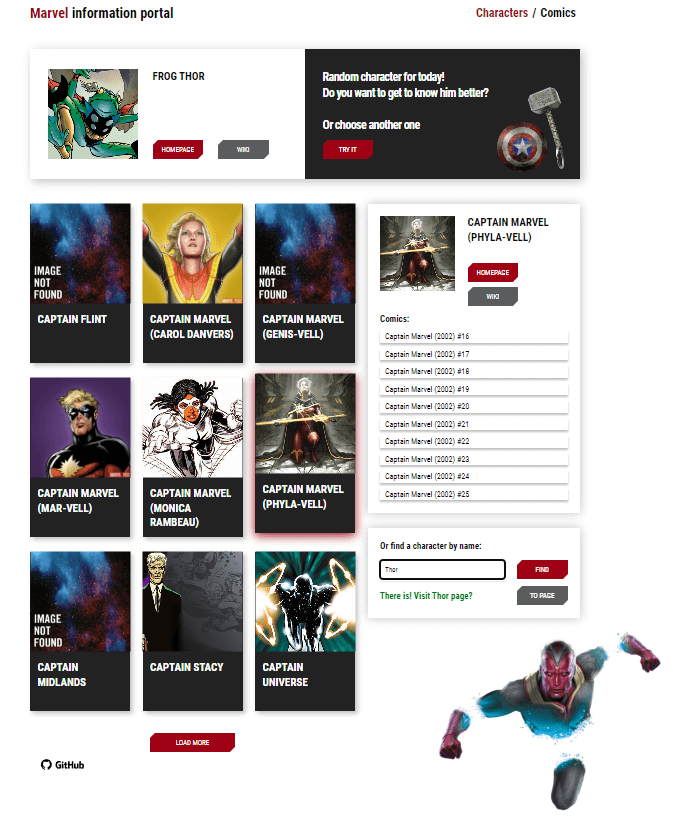

<h1 align="center">Marvel Information Portal</h1>

<p align="center">

  

  

## Description

**All about your favorite Marvel Heroes!**

🌱 [TAP TO SEE MARVEL APP](https://marvel-react-iota.vercel.app/)  

<p align="center">

<p></p>

The application gains access to the Marvel API and displays favorite heroes on the screen. 
</p> 

Also, you can see in which comics they appeared, visit their Homepage, or go to Wikipedia. 
</p>

When you click the Try button, the application will show you a random superhero.
</p>
</p>

## Technologies in the project

[](https://skillicons.dev)

## Project setup

```
npm install
npm run start
```

## Future scope

- Add accessibility on all devices.
